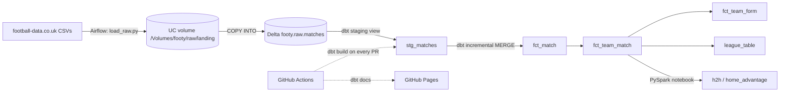
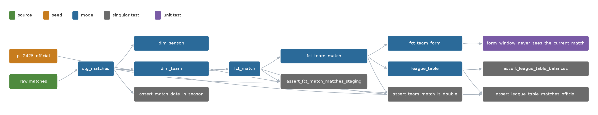

# footy-warehouse


An ELT pipeline on the Databricks lakehouse. It loads five seasons of six European football leagues from football-data.co.uk (9,635 matches) into Delta Lake. dbt models them with an incremental MERGE and 40 data tests, Airflow runs it daily, and GitHub Actions builds every pull request in its own schema.

- **Live dbt docs and lineage:** https://gilaltman8.github.io/footy-warehouse
- **A pull request blocked by a failing test, then fixed:** [PR #1](https://github.com/gilaltman8/footy-warehouse/pull/1)
- **Design log, one line per decision:** [NOTES.md](NOTES.md)

## Why this exists

I ported patterns I ran in production at a lending fintech onto dbt, Airflow and Databricks:
- slice reloads and MERGE-style nightly syncs
- reporting views
- scheduled jobs with retries and a failure log
- cross-system reconciliation
- PR-based deploys

The football data is public, so every claim below can be checked.

## Architecture



**Three environments, one codebase.** `dev` is where I build by hand. `ci` is rebuilt by GitHub Actions on every PR. `prod` is written only by Airflow. Each target writes to its own schemas (`footy.dev_marts`, `footy.ci_marts`, `footy.prod_marts`).

## Data model



*Drawn from dbt's `manifest.json` by [`docs/make_lineage.py`](docs/make_lineage.py) (needs `matplotlib`): sources, the seed, models, singular tests and the unit test. Generic tests are left out to keep it readable; the full graph is on the [docs site](https://gilaltman8.github.io/footy-warehouse).*

| Model | Grain | Key | Materialization | Rows |
|---|---|---|---|---|
| `stg_matches` | one match (deduplicated, latest load wins) | `match_key` | view | 9,635 |
| `dim_team` | one team, any season | `team_key` | table | 160 |
| `dim_season` | one season | `season_key` | table | 5 |
| `fct_match` | one match: typed stats, points, odds | `match_key` | incremental MERGE, liquid clustered | 9,635 |
| `fct_team_match` | one team in one match (each match twice) | `team_match_key` | table | 19,270 |
| `fct_team_form` | one team in one match, plus form over the previous 5 | `team_match_key` | table | 19,270 |
| `league_table` | one team in one league-season | season, league, team | table | 602 |
| `h2h` *(PySpark)* | one ordered pair of teams | team, opponent | Delta via `saveAsTable` | 4,008 |
| `home_advantage` *(PySpark)* | one team in one league-season | team, league, season | Delta via `saveAsTable` | 602 |

`pipeline_log` gets one row per `fct_match` build in every environment. The model's post-hook creates the table if it is missing, then inserts the row.

## Design decisions

Each decision has three parts: what I did, why, and what changes at 100× the data. The full log, with the incidents behind them, is in [NOTES.md](NOTES.md).

1. **Raw keeps every column as STRING** (except `match_date` and `_loaded_at`).
   - *Why:* casting is staging's job, so a bad value never fails a load.
   - *At 100×:* the same rule, plus schema-drift alerts.
2. **Delete + COPY INTO at raw, MERGE in the marts.**
   - *Why:* a raw load replaces one (season, league) slice as a whole, which makes it idempotent and simple. `force=true` is needed because COPY INTO otherwise skips a file it has already loaded, which would leave the slice empty. The marts are keyed, so they MERGE.
   - *At 100×:* one atomic `INSERT … REPLACE WHERE` per slice, so readers never see an empty slice. Delta history shows that window today.
3. **The watermark is on `_loaded_at`, not `match_date`.**
   - *Why:* a correction to an old match arrives with a new load time.
   - *Proof:* I corrected one 2024 result in raw. The incremental run MERGEd exactly 1 row (1 updated, 0 inserted), and the two league totals moved by +2 and −1. With a `match_date` watermark, the correction would have been skipped forever, silently.
   - *At 100×:* the same rule.
4. **A 3-day lookback on the watermark** (`var lookback_days`).
   - *Why:* a reload stamped with an older `_loaded_at` would otherwise be missed. Reprocessing is harmless because the MERGE is keyed. Setting it to 0 gives exact metrics when I need them.
   - *At 100×:* tune the window to the source's real correction lag, measured.
5. **Liquid clustering on (`match_date`, `div_code`), not partitioning.**
   - *Why:* the table is one file of about 300 KB. Partitioning by season × league would make dozens of tiny files. Clustering keys can also be changed later without rewriting the table. dbt-databricks runs OPTIMIZE after each build.
   - *At 100×:* cluster on the columns the queries actually filter by.
6. **Staging as a view.**
   - *Why:* it costs nothing, always reflects raw, and has no state to backfill.
   - *At 100×:* materialise it as a table once many marts read it and the reads get slow.
7. **One `dbt build` task in Airflow, not one task per model.**
   - *Why:* dbt already knows the model graph and stops downstream of a failure. CI showed this as `SKIP=28` after one failing staging test. Airflow owns ingest, retries and the schedule.
   - *At 100×:* per-model tasks (astronomer-cosmos) for per-model retries and timing.
8. **One writer at a time into raw.**
   - *Why:* on the first DAG run, six parallel loads hit `COPY_INTO_DUPLICATED_FILES_COPY_NOT_ALLOWED`. COPY INTO tracks loaded files per table, so concurrent COPY INTOs into one table conflict. An Airflow pool with one slot keeps six tasks with their own retries and logs, but only one writer.
   - *At 100×:* stage each slice and commit once.
9. **Validate before anything destructive.**
   - *Why:* a typo'd season (9999) got an HTTP 200 from the source with the 1998/99 files, and five tasks went green on 1,678 wrong rows.
   - *The fix has three layers:*
     - the season code is checked before any network call
     - match dates are checked before the slice is deleted
     - a dbt test (`assert_match_date_in_season`) proved red on the contaminated data
   - *At 100×:* the same layers. A status code is not proof of correct data.
10. **The availability sensor runs in reschedule mode.**
    - *Why:* if the season file isn't published yet, the sensor releases its worker between checks (every 5 min, up to 1 h). In poke mode it would hold a worker for the whole wait.
    - *At 100×:* deferrable sensors on the triggerer.
11. **dev / CI / prod targets from one profile pattern.**
    - *Why:* the same code goes to three schema prefixes through one `generate_schema_name` macro. Credentials come only from environment variables, so no secret is in the repo.
    - *Lesson:* when only the orchestrator writes prod, dev drifts. On Day 10, dev still held 4,953 matches while prod had 9,635.
    - *At 100×:* separate workspaces per environment, with service principals.
12. **Data tests and unit tests catch different things.**
    - *Data tests* find bad data. *Unit tests* find bad logic before it meets data.
    - *Proof:* the unit test on the rolling-form window uses 7 hand-made rows. When I widened the frame by one row, it failed with `t1 NULL→3`.
    - *At 100×:* unit tests on every non-trivial transformation, run in CI.
13. **Why Spark is illustrative here.**
    - *Why:* the PySpark job matches SQL exactly (4,008 and 602 rows). Every aggregate, shuffle and join ran in 4–16 ms, while each scan took about 6 s, so the job is overhead at this size. I wrote it to read plans honestly: one shuffle with a partial aggregate before it (19,270 → 4,008 rows), two broadcast joins, and AQE coalescing 16 shuffle partitions into 1.
    - *At 100×:* Spark for logic SQL can't express, Python/ML reuse, or streaming.
14. **Two freshness signals, because silence never fails a task.**
    - *Why:* on Day 11 the latest match was 17 days old and nothing was red. The source had stopped publishing, and the scheduler hadn't run. `_loaded_at` tells me whether *I* ran; `MAX(match_date)` tells me whether *the world* moved.
    - *At 100×:* alert on both, with thresholds that know the fixture calendar.
15. **How I'd spend quota on a paid workspace.**
    - *Why:* in a paid workspace, compute is the bill.
    - *At 100×:*
      - serverless SQL warehouses with short auto-stop for dbt and analysts
      - job compute (not all-purpose clusters) for scheduled runs
      - cluster policies and budgets per team
      - OPTIMIZE and clustering only on tables that are actually queried

## Run it yourself

About 30 minutes. You need:
- a Databricks workspace (Free Edition works) with a SQL warehouse and a personal access token
- Python 3.12
- Docker and the Astro CLI, for the Airflow part

**1. Workspace objects.** In the Databricks SQL Editor:

```sql
CREATE CATALOG IF NOT EXISTS footy;
USE CATALOG footy;
CREATE SCHEMA IF NOT EXISTS raw;
CREATE SCHEMA IF NOT EXISTS dev;
CREATE SCHEMA IF NOT EXISTS ci;
CREATE SCHEMA IF NOT EXISTS prod;
CREATE VOLUME IF NOT EXISTS raw.landing;   -- /Volumes/footy/raw/landing/
```

**2. Clone and install.**

```bash
git clone https://github.com/gilaltman8/footy-warehouse.git && cd footy-warehouse
python3 -m venv .venv && source .venv/bin/activate
pip install -r requirements.txt
export DATABRICKS_HOST="https://dbc-XXXX.cloud.databricks.com"
export DATABRICKS_HTTP_PATH="/sql/1.0/warehouses/XXXX"
export DATABRICKS_TOKEN="dapiXXXX"          # never commit this
```

**3. Load raw.** Each run replaces one season's slices and is safe to repeat.

```bash
for s in 2627 2526 2425 2324 2223; do python ingest/load_raw.py --season $s; done
```

**4. Build the warehouse.** Create `~/.dbt/profiles.yml` from the template:

```bash
mkdir -p ~/.dbt && sed 's/target: ci/target: dev/; s/    ci:/    dev:/; s/schema: ci/schema: dev/' dbt/footy_wh/profiles.ci.yml > ~/.dbt/profiles.yml
cd dbt/footy_wh && dbt deps && dbt build      # expect PASS=49: 7 models, 40 data tests, 1 unit test, 1 seed
cd ../.. && python -m pytest -q tests/        # 5 passed
```

**5. Orchestrate.**

```bash
cd airflow
printf 'DATABRICKS_HOST=%s\nDATABRICKS_HTTP_PATH=%s\nDATABRICKS_TOKEN=%s\n' "$DATABRICKS_HOST" "$DATABRICKS_HTTP_PATH" "$DATABRICKS_TOKEN" > .env
astro dev start                               # UI on http://localhost:8080
```

In the UI, unpause `footy_pipeline`. To backfill a season, trigger it with the `season` param set, for example `2324`. `airflow_settings.yaml` creates the Variable, the pool and the HTTP connection on every start.

## Testing & CI

- **40 data tests:**
  - schema tests (unique, not_null, accepted_values, relationships)
  - a custom generic test (`not_same_team`)
  - singular reconciliations: each match counted twice in `fct_team_match`, wins = losses and goals for = against in every league-season, match dates inside their season, and the computed 2024/25 Premier League table against the published one
  - three `dbt_expectations` distribution checks
- **1 dbt unit test** on the rolling-form window.
- **5 pytest tests** on ingest parsing.

On every pull request, GitHub Actions runs pytest, `sqlfluff lint`, then `dbt build --target ci` into the `ci_*` schemas. Branch protection requires the build to pass. On `main`, it also publishes the dbt docs to GitHub Pages. [PR #1](https://github.com/gilaltman8/footy-warehouse/pull/1) shows the gate working: a deliberately broken `accepted_values` turned the build red, with `FAIL 1, SKIP=28`, and the merge was blocked.

## Data contract & schema evolution

This table describes what the pipeline accepts, not what the tools support.

| Source change | Behaviour |
|---|---|
| New column, not in the mapping | Ignored by design. The explicit `RENAME` map in `load_raw.py` is the contract. |
| New column, added to the mapping | Supported. Raw evolves additively (`ALTER TABLE … ADD COLUMN`, logged as a warning), and `fct_match` follows via `on_schema_change='append_new_columns'`. |
| New column + historical values | Not automatic. Schema evolution adds the column; filling history is a separate backfill, done by reloading slices. That's how `referee` reached 2,009/2,009 English matches. |
| Renamed column | Needs a mapping change. Until then the old name arrives as NULL, and `not_null` tests on required fields catch it. |
| Removed column | Needs intervention. The mapping keeps it as NULL; decide whether to deprecate it or fail. |
| Incompatible type change | Raw is strings, so ingest never breaks. Staging casts goals strictly (the build fails) and other stats with `try_cast` (NULLs, which the tests flag). Needs intervention. |
| Corrected historical row | Supported. Reload the slice; the new `_loaded_at` makes the MERGE update that row in place. |

Schema evolution lets a table accept a column; a backfill gives history a value. They are different operations.

## Evidence

The proof lives in the repo, not only in the workspace. The Databricks token expires every 90 days and a free workspace can go idle, but the dbt docs on GitHub Pages are static and keep working.

| What | Result |
|---|---|
| Reload of one season-league slice (Day 3) | MERGE: 380 source rows, 380 updated, 0 inserted |
| One corrected 2024 result (Day 3) | MERGE: 1 updated, 0 inserted; league points +2 / −1 |
| Backfill of 23/24 and 22/23 via DAG params (Day 8) | 4,953 → 9,635 matches, predicted before the run |
| Update-only MERGE with the 3-day lookback (Day 11) | 5,027 updated, 0 inserted, 0 files rewritten (deletion vectors) |
| 2024/25 Premier League table | [`pl_2425_official.csv`](dbt/footy_wh/seeds/pl_2425_official.csv) + [`assert_league_table_matches_official.sql`](dbt/footy_wh/tests/assert_league_table_matches_official.sql), which pass. Changing one points value makes the test fail on exactly that team. |
| Unit test on the form window | Widening the frame by one row → `t1 NULL→3`, test failed |
| CI gate | [PR #1](https://github.com/gilaltman8/footy-warehouse/pull/1): red → revert → green → merged |

Live runs need a Databricks token (`DATABRICKS_*`, as GitHub secrets for CI).

## What I'd do next

1. **Per-model Airflow tasks** with astronomer-cosmos, for per-model retries and timing.
2. **Alerting that sees silence:** Slack from the failure callback, plus a scheduled check on `MAX(match_date)` against the fixture calendar.
3. **Contracts enforced at ingest:** fail on an unknown change to a required column, instead of logging a warning.
